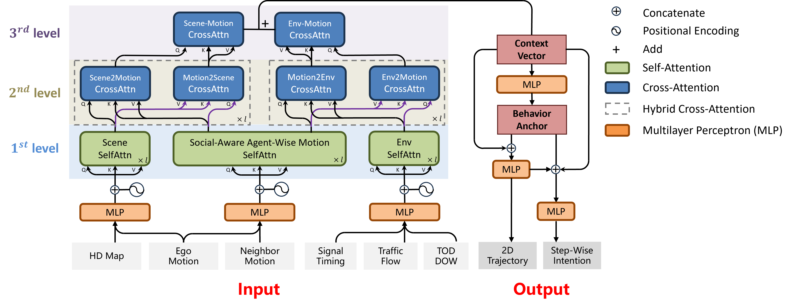

# RLR-prediction

This repo is the official implementation of the paper:

Hierarchical Transformer-Based Red-Light Running Prediction Model for Two-Wheelers with Multitask Learning

Yuansheng Lian, Ke Zhang, Meng Li, Jingxian Lin

IEEE-TIV

## Overview


## Abstract
The red-light running behavior of two-wheelers presents significant safety concerns at urban signalized intersections. Anticipating their intentions and trajectories is crucial, as early detection can substantially mitigate potential risks. However, predicting such behavior is challenging due to the intricate interactions among red-light runners, neighboring traffic agents, the local and global traffic environment. To this end, we propose a Hierarchical Transformer-based red-light running prediction model for two-wheelers in connected environments. Our model features a three-level hierarchical encoder, which effectively integrates multi-source input data. A Social-Aware Motion Encoder, Scene Information Encoder and Environment Encoder are first proposed to extract the first-level input features. Subsequently, we propose a Hierarchical Hybrid Encoder and utilize cross-attention modules to capture the interdependencies of the extracted features at the second and the third levels, respectively. To facilitate simultaneous prediction of red-light running intention and trajectory, we employ multitask learning and design an anchor-based structure to allow flows of information in different decoders. The proposed model is evaluated using real-world data collected from a signalized intersection over a period of 7 days. Our model demonstrates state-of-the-art performance across various evaluation metrics, validating its efficacy in predicting future red-light running behaviors in dynamic traffic scenarios. 

## Getting started
### Installation
Step 1: Create a python environment

```
conda create --name RLR_prediction python=3.9
conda activate RLR_prediction
```

Step 2: Install the required packages

```
pip install -r requirements.txt
```

### Dataset
We apologize that we are not able to provide Yizhuang dataset due to data privacy requirement.

Please prepare your data according to the paper and put the processed files in /data. You should also modify the class yizhuang_dataset in /datasets/yizhuang_dataset.py.

### Train
```
python main.py --mode train --data_root <your_data_root>
```


## Acknowledgement
We appreciate the following github repos for their valuable code base:
[AgentFormer](https://github.com/Khrylx/AgentFormer)
